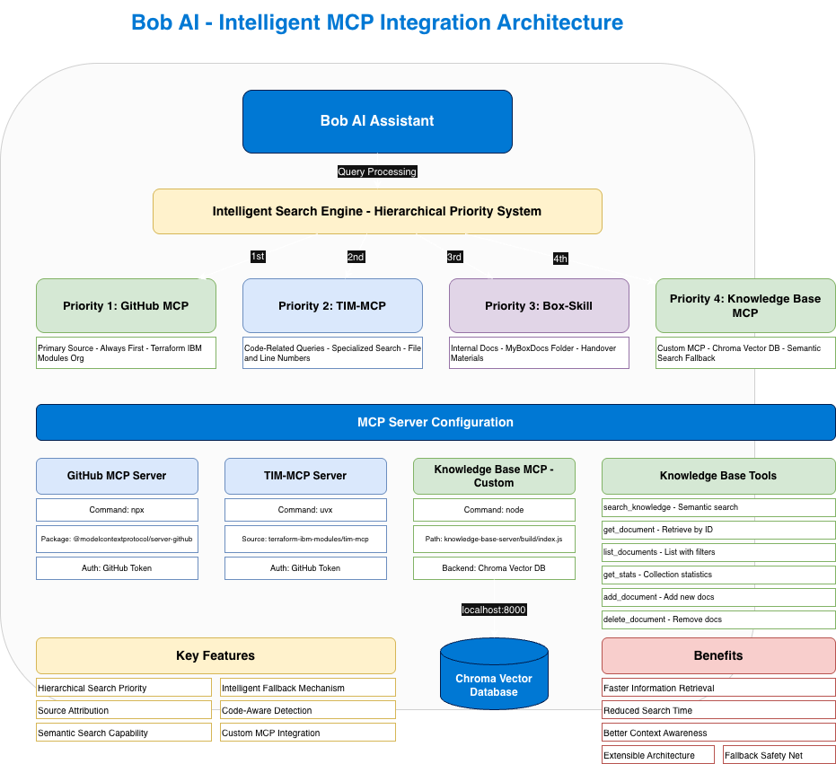
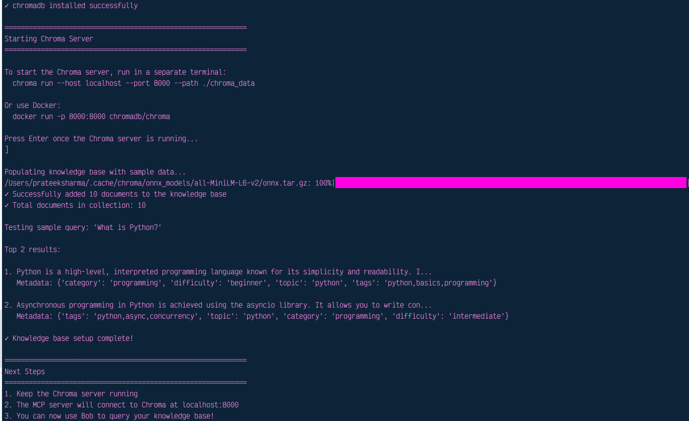
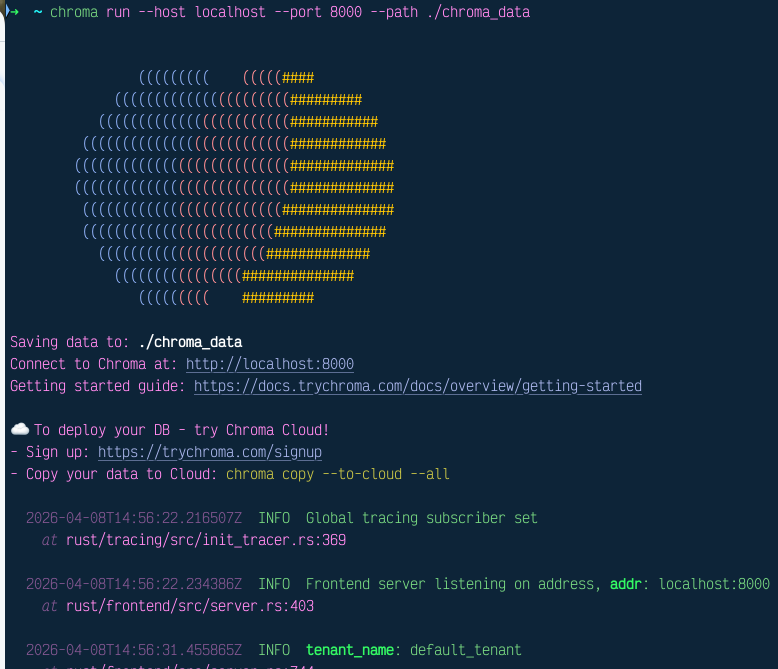

# Bob Team Hack - Intelligent MCP Integration Project

## 🎯 Overview

This project demonstrates an advanced implementation of Model Context Protocol (MCP) servers integrated with Bob AI Assistant, featuring a hierarchical search priority system and a custom knowledge base server powered by Chroma vector database.

## 🏗️ Architecture



The system implements a sophisticated multi-tier search strategy that intelligently routes queries through various MCP servers based on priority and context.

## 🔑 Key Features

### 1. **Hierarchical Search Priority System**
- **Priority 1**: GitHub MCP - Primary source for Terraform IBM Modules organization
- **Priority 2**: TIM-MCP - Specialized code search and analysis
- **Priority 3**: Box-Skill - Internal documentation (MyBoxDocs)
- **Priority 4**: Knowledge Base MCP - Custom semantic search fallback

### 2. **Intelligent Query Routing**
- Automatic code-related question detection
- Context-aware source selection
- Smart fallback mechanisms
- Source attribution for all responses

### 3. **Custom Knowledge Base MCP Server**
- Built with TypeScript and Node.js
- Powered by Chroma vector database
- Semantic search capabilities
- 6 specialized tools for knowledge management

### 4. **Mode-Aware Operations**
- Automatic mode switching for diagram generation
- Draw.io integration for visual representations
- Seamless mode transitions

## 🚀 MCP Servers Configuration

### 1. GitHub MCP Server
**Purpose**: Primary source for GitHub repository information

```json
{
  "command": "npx",
  "args": ["-y", "@modelcontextprotocol/server-github"],
  "env": {
    "GITHUB_PERSONAL_ACCESS_TOKEN": "Your-token-here"
  }
}
```

**Capabilities**:
- Repository search and browsing
- Issue and PR tracking
- Code file access
- Documentation retrieval

---

### 2. Terraform IBM Modules MCP (TIM-MCP)
**Purpose**: Specialized code search for Terraform IBM Modules

```json
{
  "command": "uvx",
  "args": [
    "--from",
    "git+https://github.com/terraform-ibm-modules/tim-mcp.git",
    "tim-mcp"
  ],
  "env": {
    "GITHUB_TOKEN": "Your-token-here"
  }
}
```

**Capabilities**:
- Code-specific searches
- File and line number references
- Module analysis
- Terraform configuration parsing

---

### 3. Knowledge Base MCP Server (Custom)
**Purpose**: Semantic search and knowledge management

```json
{
  "command": "node",
  "args": ["knowledge-base-server/build/index.js"],
  "env": {
    "CHROMA_HOST": "localhost",
    "CHROMA_PORT": "8000",
    "CHROMA_COLLECTION": "knowledge_base"
  }
}
```

**Available Tools**:
1. `search_knowledge` - Semantic search with similarity scoring
2. `get_document` - Retrieve specific documents by ID
3. `list_documents` - List documents with optional filtering
4. `get_stats` - Get collection statistics
5. `add_document` - Add new documents to knowledge base
6. `delete_document` - Remove documents from knowledge base

**Backend**: Chroma Vector Database (localhost:8000)

| | |
|---|---|
|

## 📊 Search Flow Decision Tree

```
Question Received
    ↓
[0] Needs Diagram/Visualization?
    ↓
    ├─→ YES → Switch to Draw.io Mode
    │         ↓
    │         Generate Diagram
    │         ↓
    │         Return to Code Mode
    ↓
    └─→ NO → Continue to Search
    ↓
[1] Search GitHub MCP (ALWAYS)
    ↓
    ├─→ Information Found? → Return with GitHub URL
    ↓
    └─→ Not Found → Continue
    ↓
[2] Is Question Code-Related?
    ↓
    ├─→ YES → Search TIM-MCP
    │         ↓
    │         ├─→ Found? → Return with file name + line numbers
    │         └─→ Not Found → Continue to [3]
    ↓
    └─→ NO → Skip to [3]
    ↓
[3] Search GitHub MCP (Secondary/Deeper)
    ↓
    ├─→ Found? → Return with repository details
    └─→ Not Found → Continue
    ↓
[4] Search Box-Skill (MyBoxDocs)
    ↓
    ├─→ Found? → Return with filename
    └─→ Not Found → Continue
    ↓
[5] Search Knowledge Base MCP
    ↓
    ├─→ Found? → Return with source name
    └─→ Not Found → Continue
    ↓
[6] Fallback to GitHub MCP
    ↓
    Return Terraform-IBM-modules org info
```

## 🛠️ Setup Instructions

### Prerequisites
- Node.js (v18 or higher)
- Python 3.8+
- GitHub Personal Access Token
- Chroma DB

### 1. Install Dependencies

```bash
# Install Node.js dependencies for Knowledge Base MCP
cd knowledge-base-server
npm install
npm run build
```

### 2. Setup Chroma Vector Database

```bash
# Install Chroma
pip install chromadb

# Start Chroma server
chroma run --host localhost --port 8000 --path ./chroma_data
```

### 3. Populate Knowledge Base (Optional)

```bash
cd knowledge-base-server
python setup_chroma.py
```

### 4. Configure MCP Servers

Update `.bob/mcp.json` with your GitHub tokens:

```json
{
  "mcpServers": {
    "github": {
      "env": {
        "GITHUB_PERSONAL_ACCESS_TOKEN": "your_github_token_here"
      }
    },
    "terraform-ibm-modules-mcp": {
      "env": {
        "GITHUB_TOKEN": "your_github_token_here"
      }
    }
  }
}
```

### 5. Restart Bob

Restart Bob AI Assistant to load the MCP server configurations.

## 📖 Usage Examples

### Search for Information
```
"Search for VPC module documentation in Terraform IBM Modules"
```
Bob will search GitHub MCP first, then fall back to other sources if needed.

### Code-Related Queries
```
"Show me the implementation of the VPC resource in main.tf"
```
Bob will use TIM-MCP for specialized code search with file and line references.

### Knowledge Base Queries
```
"Search my knowledge base for information about Python async programming"
```
Bob will use the Knowledge Base MCP server for semantic search.

### Add to Knowledge Base
```
"Add this to my knowledge base: FastAPI is a modern Python web framework..."
```
Bob will use the `add_document` tool to store the information.

## 🎨 Diagram Generation

The project includes automatic diagram generation capabilities:

```
"Create a diagram showing the MCP architecture"
```

Bob will automatically switch to Draw.io mode, generate the diagram, and return to Code mode.

## 📁 Project Structure

```
bob-team-hack/
├── .bob/
│   ├── mcp.json                    # MCP server configurations
│   ├── rules/
│   │   ├── PROJECT_RULES.md        # Search priority rules
│   │   └── rules.yaml              # Global skill rules
│   ├── skills/
│   └── custom_modes.yaml
├── knowledge-base-server/
│   ├── src/
│   │   └── index.ts                # Custom MCP server implementation
│   ├── build/                      # Compiled JavaScript
│   ├── package.json
│   ├── tsconfig.json
│   ├── setup_chroma.py             # Database setup script
│   ├── README.md                   # Knowledge Base documentation
│   └── USAGE_GUIDE.md              # Detailed usage guide
├── mcp-architecture-diagram.drawio # Technical architecture diagram
├── mcp-integration-presentation.drawio # Presentation-ready diagram
└── README.md                       # This file
```

## 🔍 Code-Related Question Detection

Questions are automatically classified as code-related if they contain:

**Programming Languages**: Python, JavaScript, TypeScript, Go, Java, Terraform, HCL, Ruby, Shell, Bash, etc.

**Code Structure Terms**: Function, method, class, interface, struct, variable, constant, parameter, module, package, library

**Development Actions**: Implement, code, write, develop, debug, fix, error, compile, build, deploy

**Technical Concepts**: API, endpoint, database, query, configuration, environment

## 📊 Response Format

All responses include clear source attribution:

```
**Source**: [Source Name]
**Location**: [URL/Filename/Path]

[Direct Answer]

**Reference**:
- [Specific link or file location]
- [Line numbers if applicable]
- [Additional context]
```

## 🎯 Benefits

✅ **Faster Information Retrieval** - Hierarchical search reduces query time

✅ **Better Context Awareness** - Intelligent routing based on query type

✅ **Extensible Architecture** - Easy to add new MCP servers

✅ **Fallback Safety Net** - Multiple sources ensure information availability

✅ **Source Transparency** - Always know where information comes from

✅ **Semantic Search** - Vector database enables natural language queries

## 🔧 Troubleshooting

### Chroma Connection Issues
```bash
# Ensure Chroma is running
chroma run --host localhost --port 8000

# Check if port is available
lsof -i :8000
```

### MCP Server Not Responding
1. Verify GitHub tokens are set correctly
2. Check MCP server paths in `.bob/mcp.json`
3. Rebuild Knowledge Base server: `cd knowledge-base-server && npm run build`
4. Restart Bob AI Assistant

### Empty Search Results
1. Ensure Chroma server is running
2. Verify documents are populated: `python setup_chroma.py`
3. Check collection name matches configuration

## 📚 Documentation

- [Project Rules](/.bob/rules/PROJECT_RULES.md) - Detailed search priority rules
- [Knowledge Base Usage Guide](/knowledge-base-server/USAGE_GUIDE.md) - Complete KB setup and usage
- [Knowledge Base README](/knowledge-base-server/README.md) - Technical documentation

## 🤝 Contributing

This project was created for the Bobathon hackathon. Contributions and improvements are welcome!

## 📄 License

MIT

## 👥 Team

**Bobathon Project Team**

---

**Version**: 1.0  
**Last Updated**: 2026-04-08  
**Status**: Active

---

Made with ❤️ using Bob AI Assistant